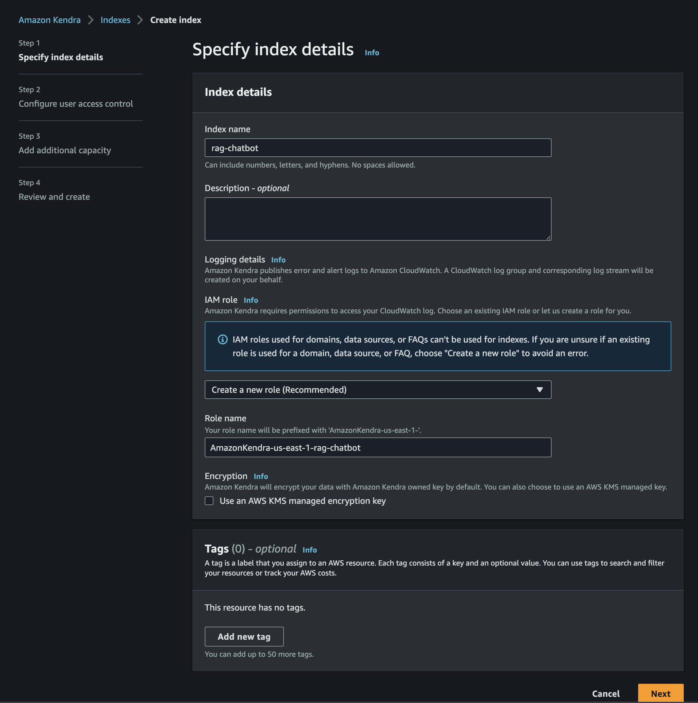
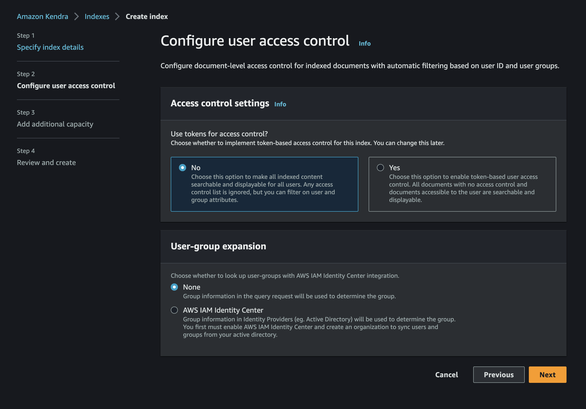
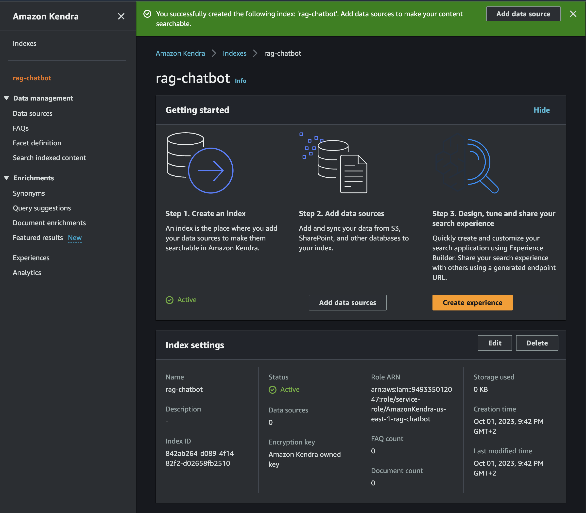
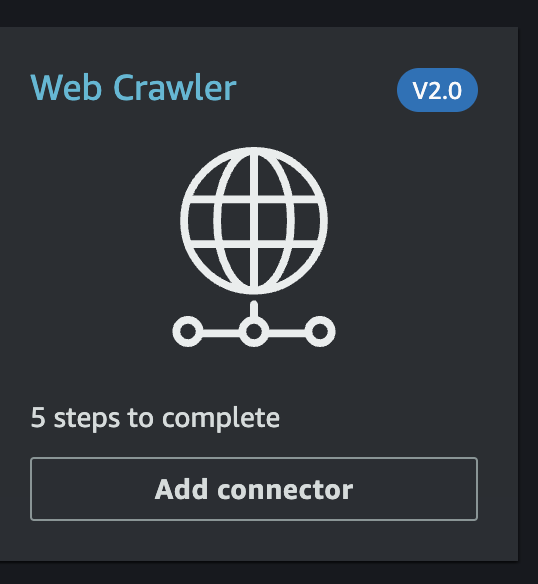
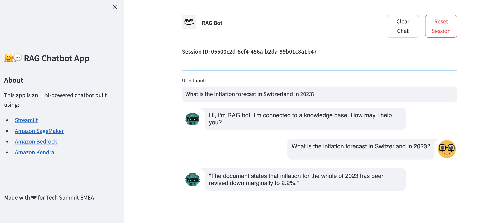
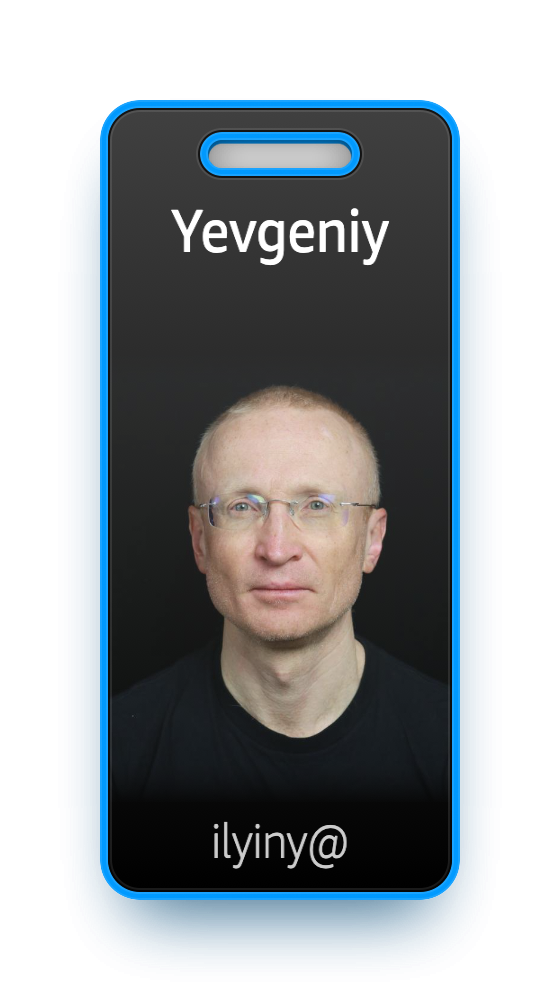

# Generative AI retrieval-augmented generation (RAG) chatbot workshop

This repository contains instructions and examples to create your first generative AI chatbot connected to a knowledge base. 

In this workshop you're going to learn:
- a foundational generative AI design pattern: retrieval augmented generation (RAG)
- how to use Amazon Kendra to implement a knowledge base with a document index
- how to ingest documents into the knowledge base using Kendra connectors
- how to use Amazon SageMaker JumpStart to deploy an open source large language model (LLM) as a real-time endpoint and use the endpoint for text generation
- how to use HuggingFace TGI container and Amazon SageMaker to deploy an LLM as a real-time endpoint
- how to use Amazon Bedrock to connect to LLMs and use them via an API
- how to use popular Python frameworks [streamlit](https://streamlit.io/) and [langchain](https://python.langchain.com/docs/get_started/introduction) to implement generative AI applications in hours

## Pre-requisites and environment setup
You need access to an AWS account. You can use your own account or the shared account, which is given by the workshop moderators.

If you use your own account make sure to fulfill the following pre-requisites before the workshop:
1. Admin access to the account
1. If you'd like to experiment with an LLM real-time SageMaker endpoint, you must set the quota for `ml.g5.12xlarge` for your AWS Account to at least 1. You can increase the quota in AWS console as described in [this instructions](https://aws.amazon.com/premiumsupport/knowledge-center/manage-service-limits/). You don't need to increase quota if you're going to use Amazon Bedrock only
1. [Request access](https://docs.aws.amazon.com/bedrock/latest/userguide/model-access.html) to Amazon Bedrock models
3. [AWS Console access](https://console.aws.amazon.com/console/home?#)

The next sections contain step-by-step instructions how to setup the required development environments.

### Clone the workshop repository
Clone the public GitHub [repo](https://github.com/aws-samples/generative-ai-on-aws-architecture-patterns) to your local notebook:

```sh
git clone https://github.com/aws-samples/generative-ai-on-aws-architecture-patterns.git
```

### Setup AWS Cloud9 environment
You're going to use AWS Cloud9 environment to prepare the chatbot app container and build and deploy the end-to-end application stack.

To setup AWS Cloud9:
- Sign in an AWS account 
- If you don't have an existing Cloud9 environment, setup a new one. See [Hello AWS Cloud9](https://docs.aws.amazon.com/cloud9/latest/user-guide/tutorial.html) for a step-by-step instruction
- Use `m5.large` instance and `Amazon Linux 2` platform
- Open the Cloud9 environment
- Upload the folder where you cloned the workshop repository, e.g. `genai-rag-bot-workshop`, to the Cloud9 environment
- Open the terminal in  Cloud9 and run `cd genai-rag-bot-workshop/`
- Run `aws sts get-caller-identity` and make sure you have the Administrator role
- Run `chmod +x resize-disk.sh`
- Run `./resize-disk.sh 100`

#### Upgrade to Python 3.10
The Lambda function you're going to implement requires Python 3.10 runtime. This in turn requires the Python 3.10 version of AWS SAM CLI. Before start with the workshop, you need to upgrade Cloud9 Python version to 3.10.

Follow the instructions below and run all commands in Cloud9 terminal:

1. Install `pyenv`: 
```sh
git clone https://github.com/pyenv/pyenv.git ~/.pyenv
cat << 'EOT' >> ~/.bashrc
export PATH="$HOME/.pyenv/bin:$PATH"
eval "$(pyenv init -)"
EOT
source ~/.bashrc
```

2. Install openSSL:
```sh
sudo yum update -y
sudo yum erase openssl-devel -y
sudo yum install openssl11 openssl11-devel xz-devel libffi-devel bzip2-devel wget -y
```

3. This command installs Python 3.10 and runs for several minutes:
```sh
pyenv install 3.10
pyenv global 3.10
```

4. Set the Python alias:
```
export PATH="$HOME/.pyenv/shims:$PATH"
```

5. Confirm the Python version:
```sh
source ~/.bash_profile
python --version
```

#### Upgrade AWS SAM CLI
To work with Python 3.10 runtime, you need to upgrade SAM to the latest version:
```sh
wget https://github.com/aws/aws-sam-cli/releases/latest/download/aws-sam-cli-linux-x86_64.zip
unzip aws-sam-cli-linux-x86_64.zip -d sam-installation
sudo ./sam-installation/install --update
sam --version
```

### Setup SageMaker Studio
You're going to use SageMaker Studio to deploy a real-time LLM endpoint. 
You don't need Studio and the endpoint if you use Amazon Bedrock API to connect to an LLM. You can also skip all SageMaker-related sections if you're going to use Amazon Bedrock only.

To setup Studio:
1. [Provision a SageMaker domain](https://docs.aws.amazon.com/sagemaker/latest/dg/gs-studio-onboard.html) if you don't have one
2. [Provision a user profile](https://docs.aws.amazon.com/sagemaker/latest/dg/domain-user-profile-add-remove.html) if you don't have one

#### SageMaker execution role permissions
You need the following permissions for your Studio user profile execution role:
- managed policy [`AmazonSageMakerFullAccess`](https://us-east-1.console.aws.amazon.com/iamv2/home?region=us-east-1#/policies/details/arn%3Aaws%3Aiam%3A%3Aaws%3Apolicy%2FAmazonSageMakerFullAccess)
- `servicequotas:GetServiceQuota` API permission
- `bedrock:*` API permission

Use the following inline permission policy to add to the user profile execution role:
```json
{
    "Version": "2012-10-17",
    "Statement": [
        {
            "Sid": "ServiceQuotas",
            "Effect": "Allow",
            "Action": [
                "servicequotas:GetServiceQuota"
            ],
            "Resource": "*"
        },
        {
            "Sid": "Bedrock",
            "Effect": "Allow",
            "Action": "bedrock:*",
            "Resource": "*"
        }
    ]
}
```
**TODO**: attach the inline policy to the execution role via CLI

Add `bedrock.amazonaws.com` to the user profile execution role trust relationships:
```json
{
    "Effect": "Allow",
    "Principal": {
        "Service": "bedrock.amazonaws.com"
    },
    "Action": "sts:AssumeRole"
}
```

Now you all setup to start with the RAG chatbot implementation.

## Generative AI design patterns
Before you start the hands-on activities on the RAG chatbot, let's go through some theory.

While LLMs able to perform a broad range of tasks and can generalize or do complex reasoning well, they also lack domain-specific and up-to-date knowledge.

There are two broad foundational design pattern to connect an LLM to specialized skills or to up-to-date data:
1. **Parametric learning** – changing model's parameters/weights via gradient update/backpropagation by pre-training or fine-tuning of the model
2. **Non-parametric or in-context learning (ICL)** - using a model as is without any model update with its parameters/weights frozen by providing all relevant information and context via the input prompt

This workshop presents the in-context learning option, more specifically a foundational design pattern called retrieved augmented generation (RAG). Refer to the original paper [Retrieval-Augmented Generation for Knowledge-Intensive NLP Tasks](https://arxiv.org/abs/2005.11401) for a technical overview.

There are the following other popular ICL design patterns:
- RAG to connect an LLM to knowledge bases mostly with semi-structured or unstructured data, for example enterprise search or information retrieval systems
- Natural language queries (NLQ) to connect an LLM to structured databases and to explore your databases with natural language questions
- [Reasoning and action (ReAct)](https://arxiv.org/abs/2210.03629)
- [Agents](https://go.aws/3EOgPaS)

This list is not exhaustive, but covers the majority of ICL use cases.

### In-context learning (ICL)
This very broad design pattern includes:
- Use LLMs off the shelf without fine-tuning
- Use natural language instructions in a prompt
- Provide relevant information in the prompt: instructions, context, examples, factual data, code, etc
- Do prompt engineering to improve model performance

It's important to understand, that ICL is not training and there is no parameter/weight update happening for a model.

The following example shows the ICL approach:


Refer to the original paper [A Survey on In-context Learning](https://arxiv.org/abs/2301.00234) for more details.

### RAG architecture
RAG design pattern is an extension of ICL where you connect a model to a knowledge base.


1. A user asks a question in a chatbot application
2. The chatbot sends the question to a retriever component
3. The retriever prepares and sends a search query to a knowledge base which is an information retrieval (IR) engine. The IR engine can be implemented using any technology. Refer to a deep dive on different IR approaches [How to Build an Open-Domain Question Answering System?](bit.ly/3ZppYAl) for more information. Very often the IR engine is a semantic search
4. The IR engine returns search results with document excerpts and links to relevant documents
5. The retriever sends the response to the chatbot/orchestrator
6. The chatbot/orchestrator send the user question concatenated with the search results as an LLM prompt to an LLM of your choice. Here is important to understand the context length limitation and prompt engineering approaches for a specific LLM
7. The LLM summarize the information and uses the context in the prompt to provide a factual response
8. The chatbot sends the response back to the user

The following exhibit shows a RAG example:


## Implementation
This section contains step-by-step instructions and all details needed to implement your first RAG-based generative AI application.

### Architecture overview
Now aimed with the theoretical knowledge, you're about to implement the following architecture. You use AWS services as building blocks to implement a scalable, secure, and reliable solution.


### Knowledge base
In this section you're going to create and populate a knowledge base you're going to connect to the chatbot.

Navigate to the [Cloud9 environment](https://us-east-1.console.aws.amazon.com/cloud9control/home?region=us-east-1#/).

If you'd like to ingest some documents from an Amazon S3 bucket, you can create a dedicated bucket to be connected to Amazon Kendra:
- `aws s3 mb s3://document-storage-<your alias>-<account-id>-<region>`

#### Amazon Kendra
[Amazon Kendra](https://docs.aws.amazon.com/kendra/latest/dg/what-is-kendra.html) is an enterprise search service and uses semantic and contextual understanding capabilities to return relevant documents to a natural language search query.

In this workshop you are going to use Amazon Kendra to implement a retriever part of the RAG chatbot application.

Create Kendra index:
1. Navigate to [Kendra console](https://us-east-1.console.aws.amazon.com/kendra/home?region=us-east-1#/)
2. Choose **Create and index**

3. Provide a name for the index
4. Choose create a new role, provide the role name suffix, choose **Next**

6. Choose **No** for token access control, choose **Next** 

7. Choose **Developer edition**, choose **Next**

8. Review and choose **Create**

Wait until the Kendra index is created and ready:



**TODO**: add boto3/AWS CLI Kendra index creation 

#### Amazon OpenSearch
🚧 Available in the next version of the workshop!

#### Ingestion - Kendra
You're going to ingest public press releases from Swiss Government web site https://www.admin.ch/ using a built-in [Kendra Web Crawler connector 2.0](https://docs.aws.amazon.com/kendra/latest/dg/data-source-v2-web-crawler.html).

To create web crawler and ingest documents to the index:
1. Navigate to the created index in the [Kendra console](https://us-east-1.console.aws.amazon.com/kendra/home?region=us-east-1#indexes) 
2. Choose **Add data source**

3. Choose **Web Crawler v2.0** connector and click **Add connector** You can choose any other connector to connect to a data source of your choice and ingest documents from that data source


The following instruction assumes you use the Web Crawler to ingest the documents from the site https://www.admin.ch/. If you use another data source or another web URL, configure the Kendra connector accordingly.

In the **Add data source** pane:

Step 1:
1. Provide a name for the data source, e.g. `admin-ch-public`, choose **Next**
2. Choose **Source URLs** and enter the following seed URLs:
```
https://www.admin.ch/gov/en/start/documentation/media-releases.html?dyn_pageIndex=0
https://www.admin.ch/gov/en/start/documentation/media-releases.html?dyn_pageIndex=1
https://www.admin.ch/gov/en/start/documentation/media-releases.html?dyn_pageIndex=2
https://www.admin.ch/gov/en/start/documentation/media-releases.html?dyn_pageIndex=3
https://www.admin.ch/gov/en/start/documentation/media-releases.html?dyn_pageIndex=4
https://www.admin.ch/gov/en/start/documentation/media-releases.html?dyn_pageIndex=5
https://www.admin.ch/gov/en/start/documentation/media-releases.html?dyn_pageIndex=6
https://www.admin.ch/gov/en/start/documentation/media-releases.html?dyn_pageIndex=7
https://www.admin.ch/gov/en/start/documentation/media-releases.html?dyn_pageIndex=8
https://www.admin.ch/gov/en/start/documentation/media-releases.html?dyn_pageIndex=9
```
These URLs contain about 200 the most recent press releases in English.
    - Choose **No authentication**
    - Choose **Create a new role**, provide a role suffix, choose **Next**
3. Provide the following settings on **Configure sync settings** page:
    - Sync domains with subdomains only
    - Crawl depth: **1**
    - Check **Include the files that has links to web pages**
    - Sync mode: **Full sync**
    - Frequency: **Run on demand**
4. Leave the default settings on **Set field mappings**
5. Review and create

Choose **Sync now**


The crawling and document indexing takes about 15 minutes. You don't need to wait until the sync finished and can move to the next task.

**TODO**: add boto3 or AWS CLI kendra index creation and ingestion

#### Ingestion - OpenSearch
🚧 Available in the next version of the workshop!

### Generator
You use an LLM as a generator to generate answers to the question using retrieved context.
Navigate to SageMaker Studio and open `notebooks/llm-generator.ipynb` notebook. Follow the instructions in the notebook to create an LLM real-time endpoint.

The deployment of an LLM real-time endpoint takes about 15 minutes.

### Chatbot app
In this section you create a front-end app container to run on [AWS Fargate](https://docs.aws.amazon.com/AmazonECS/latest/userguide/what-is-fargate.html).

Navigate to the [Cloud9 environment](https://us-east-1.console.aws.amazon.com/cloud9control/home?region=us-east-1#/).

The chatbot application source code is in the folder [`chatbot`](./chatbot/) of the workshop. This folder contain the following files: 
- `app.py`: the frontend utilizing the popular [streamlit](https://streamlit.io/) framework
- `Dockerfile`: Dockerfile providing a script for creation of a Docker image
- `requirements.txt`: specifies dependencies required to be installed for hosting the frontend application
- `setup.sh`: setup script consisting all the necessary steps to create a ECR repository, build the Docker image and push it to the respective repository you created

In Cloud9 terminal:
- `cd chatbot/`
- `bash setup.sh`

Make sure the container build and push finished successfully and the new image has been pushed to the ECR.

### Retriever and orchestration
The final and the most complex part of the application is to connect all components, such as LLM, UX, and retriever, together and implement orchestration of the data flow.

The retriever in the RAG design pattern is responsible for sending search request to the knowledge base or information retrieval engine and retrieving search results.

You use [LangChain](https://python.langchain.com/en/latest/) framework to implement the retriever and also the orchestration layer

The main components for the LangChain-based orchestrator are:

`AmazonKendraRetriever`
You use a built-in Kendra retriever in LangChain. This class provides an abstraction of a retriever component and allows LangChain to interact with Kendra as part of conversation chain.

You also have a custom implementation of a Kendra retriever, `KendraIndexRetriever` class in the `orchestration/kendra` folder. This class is not used in the workshop. The implementation for your reference, you can try to use own retriever for any specific requirements.

`ConversationalBufferWindowMemory`
This built-in LangChain class implements chat memory. There are two types of memory:
- short-term memory: related to one chain of a conversation. The workshop uses this type of memory
- long-term memory: related to all conversations between a user and a model. Long-term memory is useful for data analytics, validation, and model fine-tuning.

`DynamoDBChatMessageHistory`
Since you use Lambda as a stateless serverless microservice for the orchestration layer, you use Amazon DynamoDB to persist conversation memory to a DynamoDB table. The workshop also uses a built-in LangChain class to minimize the implementation effort.

`LLM endpoint`
You use a SageMaker real-time endpoint created in the **Generator** section or Amazon Bedrock API. The workshop uses a built-in LangChain class to abstract an LLM.

`PromptTemplate`
LangChain provides prompt templates for specific use cases and LLMs.

`ConversationalRetrievalChain`
Here the workshop again uses the existing LangChain class to implement a more complex flow for multi-hop conversation between an LLM, a user, and a retriever.

The conversational chain has two steps. 
First, it condenses the current question and the chat history into a standalone prompt which is sent to the retriever. Second, after the retrieving the search result sends the question and search results to a LLM. 
With the declarative nature of LangChain you can easily use a separate language model for each step. For example, you can use a cheaper and faster model for question summarization task, and a larger, more advanced and expensive model for answering the question. In this workshop you use one model for both steps.

To understand how the end-to-end orchestration works and how the components are linked together, look into the orchestration implementation in the Lambda function `orchestration/rag_app.py`.

#### Orchestration layer deployment
In this section you're going to deploy the end-to-end application stack, including UX, the backend API, and the serverless orchestration layer implemented as a Lambda function.

Navigate to the [Cloud9 environment](https://us-east-1.console.aws.amazon.com/cloud9control/home?region=us-east-1#/).

You're going to use [AWS Serverless Application Model (AWS SAM)](https://docs.aws.amazon.com/serverless-application-model/latest/developerguide/what-is-sam.html) to deploy the RAG chatbot application.

The SAM CloudFormation template deploys the following resources:
- Network infrastructure including VPC, two public subnets, and an Internet Gateway
- IAM execution roles for AWS Lambda and ECS task
- ECS cluster for hosting the front-end
- Application Load Balancer for public access of the front-end
- Amazon API Gateway API exposing the orchestration layer to the frond-end via REST API
- AWS Lambda function with the orchestration layer implementation
- Amazon DynamoDB table for conversation history persistence

Look in `template.yaml` CloudFormation template and `orchestration/rag_app.py` Lambda function code to understand how the main components connected and how the serverless backend works.

Now deploy the SAM application.

Make sure you're in the workshop folder: 
```sh
cd ~/environment/genai-rag-bot-workshop/
```

Build AWS SAM application:
```bash
sam build
```

Deploy the application:
```bash
sam deploy --guided
```

You need to provide following parameters to pass to the SAM CloudFormation template:
- `LLMContextLength`: use default 2048 if you use Falcon 40B endpoint otherwise set accordingly to your LLM of choice
- `ECRImageURI`: use the ECR URI for `rag-app` image you built in the **Chatbot app** step
- `KendraIndexId`: use the id of the Kendra index you created
- `SageMakerLLMEndpointName`: use the endpoint name you created
- `VPCCIDR`: CIDR block for the VPC, you can leave default if there is no conflicts with existing VPCs in your account

Please note, if you don't deploy a SageMaker LLM endpoint, you can use Bedrock API only.

Provide configuration parameters and wait until the CloudFormation stack deployment succeeded. 

Print the stack output (provide your stack name):
```sh
aws cloudformation describe-stacks \
    --stack-name <sam stack name>  \
    --output table \
    --query "Stacks[0].Outputs[*].[OutputKey, OutputValue]"
```

Copy the value of `RAGChatBotUrl` in a browser and start the chatbot.

If everything works fine, you should see the chatbot user interface:


## Experimentation
Now ask some questions about Switzerland or on generally any topic, for example:
`What is the usage of fossil fuels in Switzerland?` or `What is the inflation forecast in Switzerland in 2023?`.



### Try out various Bedrock LLMs in console

**TODO**: Optional activity, time permits:
- Use Kendra search functionality in the console
- use Bedrock playground to try:
    - zero-shot prompt without Kendra context
    - zero-shot prompt with Kendra context
    - Engineered prompt with Kendra context. For a prompt example see [here](https://smith.langchain.com/hub/hwchase17/weblangchain-generation)
    - Conversational chain with Kendra context

## Conclusion
Congratulations, you just build your first RAG-based generative AI application on AWS!

## Clean up
If you use own AWS account, you must delete provisioning resources to avoid unnecessary charges. You don't need to clean up if you use a workshop instructor provided account.

Remove the application CloudFormation stack:
- Execute in the Cloud9 terminal: `sam delete`. Wait until stacks are deleted

Remove the SageMaker endpoint:
- Navigate to SageMaker Studio
- Execute the **Clean up** section of the `llm-generator.ipynb` notebook

Delete the Cloud9 environment is you don't need it anymore.

Delete the Kendra data source and Kendra index.

## Resources
The following is the collection of useful links to the related resources.

- [A Survey on In-context Learning](https://arxiv.org/abs/2301.00234) – a paper on in-context learning for LLMs
- [Deploy self-service question answering with the QnABot on AWS solution powered by Amazon Lex with Amazon Kendra and large language models](https://go.aws/48oG6WK) – in-depth example of RAG chatbot with Amazon Kendra
- [How to Build an Open-Domain Question Answering System?](https://bit.ly/3ZppYAl) – a good overview of information retrieval (IR) approaches
- [Retrieval-Augmented Generation for Knowledge-Intensive NLP Tasks](https://arxiv.org/abs/2005.11401) – an original paper on RAG approach
- [Retrieval augmented generation (RAG)](https://docs.aws.amazon.com/sagemaker/latest/dg/jumpstart-foundation-models-customize-rag.html) – Amazon SageMaker Developer Guide
- [Implementing Generative AI on AWS workshop](https://catalog.us-east-1.prod.workshops.aws/workshops/80ae1ed2-f415-4d3d-9eb0-e9118c147bd4/en-US) – a public workshop
- [Large Language Model - Query Disambiguation for Conversational Retrieval, and Generative Question Answering](https://github.com/aws-solutions/qnabot-on-aws/tree/main/docs/LLM_Retrieval_and_generative_question_answering)
- [QnABot on AWS](https://aws.amazon.com/solutions/implementations/qnabot-on-aws/) - a public solution in AWS Solutions Library
- [Building (and Breaking) WebLangChain](https://blog.langchain.dev/weblangchain/)

## Contributors
The baseline of source code and overall architecture were taken from the public AWS workshop [Implementing Generative AI on AWS](https://catalog.us-east-1.prod.workshops.aws/workshops/80ae1ed2-f415-4d3d-9eb0-e9118c147bd4/en-US).

The workshop authors:

[Yevgeniy Ilyin](https://phonetool.amazon.com/users/ilyiny) | [Nikita Fedkin](https://phonetool.amazon.com/users/nikitafe) |
:---:|:---:
  |  


Special thanks to:
- [Mikael Mutafyan](https://phonetool.amazon.com/users/mimuta)
- [Aris Tsakpinis](https://phonetool.amazon.com/users/tsaris)

for help with questions, recommendations, and workshop review.

---

Copyright Amazon.com, Inc. or its affiliates. All Rights Reserved.
SPDX-License-Identifier: MIT-0